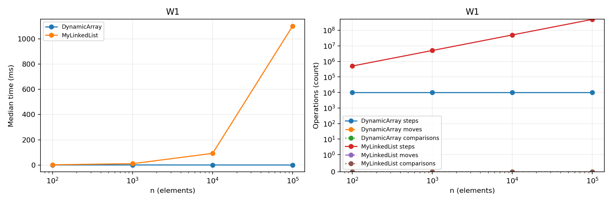
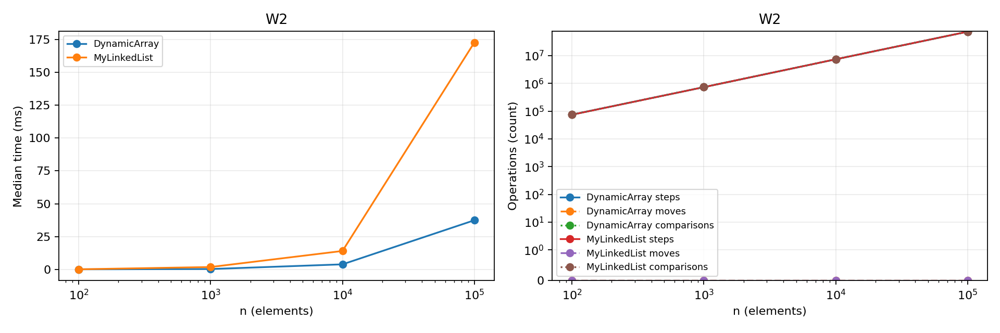
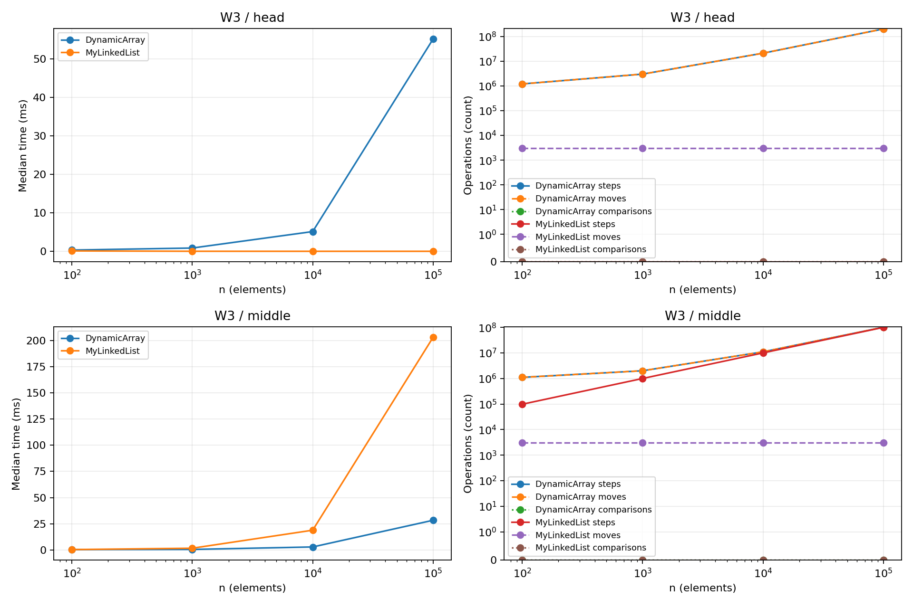
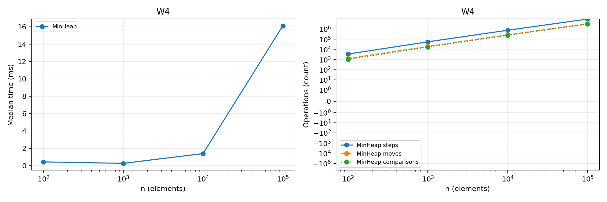

# Assignment 2: In-Memory Workload Engine
**ABDUBEK ALINA | SE2516**

## 1. Implementation and complexity
DynamicArray and MinHeap use primitive int arrays with initial capacity 4 and double capacity when full. MyLinkedList is singly linked and stores primitive int values in nodes. It keeps both head and tail, so appending is constant time. No Java collection is used to implement the structures. Indices are zero-based. Invalid indices throw IndexOutOfBoundsException and empty heap operations throw IllegalStateException.

Let n be the current number of elements and i a valid index. Average cases below assume uniformly distributed indices, a random relative order of distinct heap values, and a search target with a constant probability of being absent. Exact duplicate distribution can change heap averages. Space is temporary extra space per call, excluding the stored structure. All three structures store Θ(n) space; the array retains its peak capacity after removals.

| Structure / operation | Best | Average | Worst | Auxiliary space | Reason |
|---|---|---|---|---|---|
| Array add(x) | Θ(1) | Θ(1) amortized | Θ(n) | Θ(1), Θ(n) on growth | Most writes are constant; doubling copies n values. |
| Array add(i,x) | Θ(1) | Θ(n) | Θ(n) | Θ(1), Θ(n) on growth | Shifts n-i values; the best case appends with spare capacity. |
| Array remove(i) | Θ(1) | Θ(n) | Θ(n) | Θ(1) | Shifts n-i-1 values; removing the last needs no shifts. |
| Array get(i) | Θ(1) | Θ(1) | Θ(1) | Θ(1) | One direct indexed read. |
| Array contains(x) | Θ(1) | Θ(n) | Θ(n) | Θ(1) | Stops at a match, otherwise checks every element. |
| List add(x) | Θ(1) | Θ(1) | Θ(1) | Θ(1) | Tail permits direct append. |
| List add(i,x) | Θ(1) | Θ(n) | Θ(n) | Θ(1) | Head and append are constant; interior insertion finds predecessor. |
| List remove(i) | Θ(1) | Θ(n) | Θ(n) | Θ(1) | Finds predecessor; removing head is constant. |
| List get(i) | Θ(1) | Θ(n) | Θ(n) | Θ(1) | Traverses i links from head. |
| List contains(x) | Θ(1) | Θ(n) | Θ(n) | Θ(1) | Checks nodes until match or null. |
| Heap insert(x) | Θ(1) | Θ(1) expected amortized* | Θ(n) | Θ(1), Θ(n) on growth | Expected bubble distance is constant for random ranks; growth copies n cells. |
| Heap peekMin() | Θ(1) | Θ(1) | Θ(1) | Θ(1) | Minimum is stored at index 0. |
| Heap extractMin() | Θ(1) | Θ(log n)* | Θ(log n) | Θ(1) | Replacement may descend the heap height; equal values can stop immediately. |

*Heap insertion has O(log n) amortized worst-case cost, even though a particular resizing call costs Θ(n). Without resizing its worst case is Θ(log n). Expected insertion cost relies on the random-rank model, and is not a guarantee for arbitrary inputs. Extraction average assumes random distinct priorities. Empty operations and rejected inputs terminate in Θ(1), with exceptions. The inspection helper isValid() is Θ(n) worst-case time and Θ(1) space; size(), metrics() and reset() are Θ(1).

Doubling gives amortized constant append: copies over capacities 4,8,...,2^k total less than 2 times the final capacity. This amortized bound is different from a single-operation average over indices.

## 2. Loop invariant proofs
### DynamicArray.contains
**Invariant:** Before iteration i, every cell with index j in [0,i) has been checked and data[j] is different from x. The logical array and size remain unchanged.

**Initialization:** i=0, so the checked prefix is empty and the statement is true.

**Maintenance:** The method reads data[i] and compares it with x. If they are equal it returns true, which is correct. Otherwise the checked prefix extends through i and the invariant holds for i+1.

**Termination:** i increases by one and is bounded by size. If no early return happens, i=size and the invariant says every logical element is different from x, so false is correct.

**Conclusion:** A true result has an actual matching element; a false result means the whole logical array was checked. Therefore contains is correct.

### DynamicArray.remove
Let s be the original size and A a snapshot of the original logical array. After saving A[index], the loop starts at i=index.

**Invariant:** Before each iteration i, data[j]=A[j+1] for index<=j<i. Cells j<index are unchanged, and data[j]=A[j] for i<=j<s. The saved value is A[index].

**Initialization:** i=index. The shifted interval is empty and all array cells still have their original values, so the invariant holds.

**Maintenance:** The loop assigns data[i]=data[i+1]. Since i+1 is in the unmodified suffix, it reads A[i+1]. This extends the shifted interval by one while leaving the remaining suffix unchanged. After i increases, the invariant holds again.

**Termination:** i increases and stops at s-1. Thus every destination from index through s-2 contains the following original element. The method decreases size to s-1, making the stale last cell irrelevant.

**Conclusion:** The returned value is the requested original element. All other elements keep their order and the logical size decreases exactly once, proving removal is correct.

## 3. Benchmark method and plots
Sizes are 100, 1000, 10000 and 100000. At each size new Random(42) generates the same nonnegative input for every structure. W1 uses 10000 precomputed random indexes. W2 uses 1000 queries, exactly 500 sampled present values and 500 negative missing values. W3 inserts 1000 values and then removes 1000 values at fixed index 0 or original n/2. W4 inserts n values, extracts n values and checks nondecreasing order.

Each case discards two full warm-up runs, then records five runs on fresh structures. CSV time is the median; counters are taken from that same run. Preparation is excluded from W1-W3 but both heap construction and extraction are included in W4. Steps, moves and comparisons are counted inside methods. Array copying and shifting count a read and a move. List traversal counts a next step; reference changes count moves. Heap swaps count two reads and two moves. Validation comparisons outside structure methods are excluded from counters. Timing still includes counter increments and W4 order validation. Measurements are empirical results from this environment and can change on another computer.

## 4. Discussion
DynamicArray get reads one cell, whereas a linked-list get follows i links. This makes random list access more expensive as n grows. Array elements are adjacent in memory, so one cache line can provide several nearby values. Sequential array search benefits from spatial locality and hardware prefetching. Linked nodes are separate objects and may be far apart in memory. Following a pointer depends on the preceding node load, which limits overlap between memory reads. Even equal search comparison counts therefore do not guarantee equal execution time. Node objects also have headers, references and alignment overhead. Creating many nodes creates allocation work and can increase garbage collection pressure. W3 head operations favour the list because reference updates are constant while arrays shift most values. Middle list operations still traverse many links, so changing only two references does not make the full operation constant time. The array can be competitive in the middle because contiguous shifts have better locality than pointer traversal. A linked list is useful for repeated head changes or appending with a stored tail. MinHeap is useful when jobs must be repeatedly removed in priority order without sorting after every insertion. Small timings can fluctuate because of JVM compilation, scheduling and garbage collection, so median measurements and operation counts should be considered together.

## 5. Validation and submission
JUnit tests compare random list operations against ArrayList and heap operations against PriorityQueue. They cover empty structures, one element, duplicates, end positions, invalid indices, extreme integers, and exact counter examples. Heap property is checked after every operation in the randomized heap test, and draining verifies sorted output. The local repository contains main, feature/array, feature/list, feature/heap and feature/metrics, with release tag v1.0. A GitHub remote and its submission link still need to be created by the account owner. Bonus memory measurements and Floyd buildHeap are excluded.
